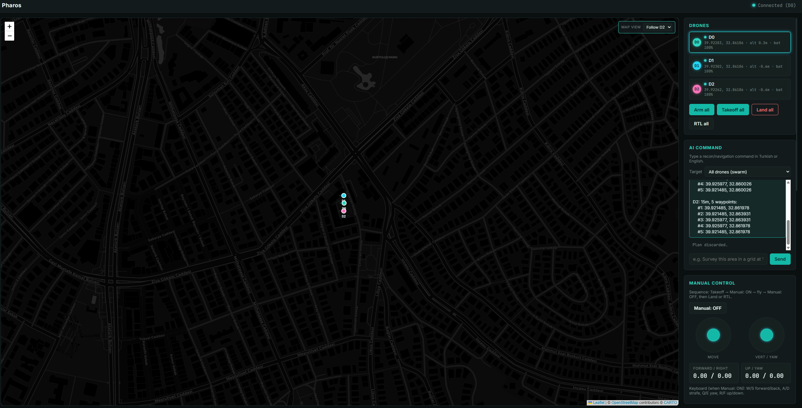
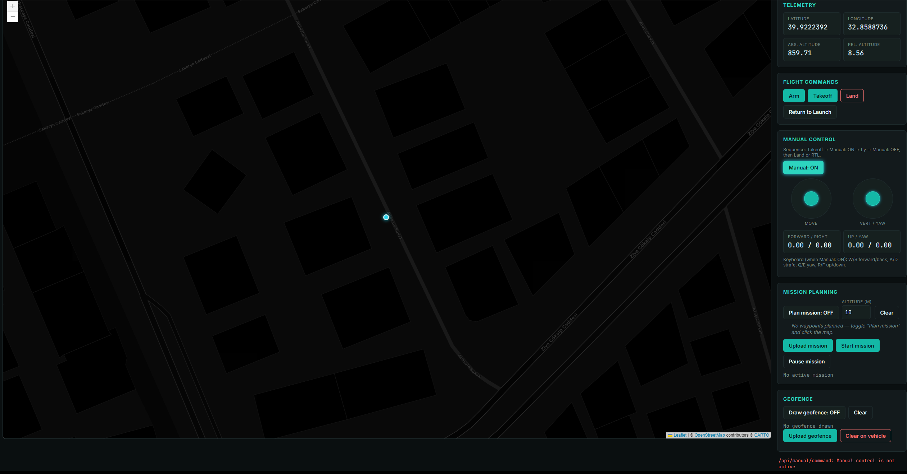

<p align="center">
  
</p>

<h1 align="center">Pharos</h1>

<p align="center">
  A web-based Ground Control Station for PX4 drones — live multi-drone telemetry,
  manual flight, autonomous mission planning, geofencing, and a natural-language
  AI command layer with mandatory human approval, running fully in simulation.
</p>

---



*AI-planned swarm scan: three drones assigned non-overlapping lawnmower sectors over a named location, previewed on the map before the operator approves and launches.*

---

## Features

### Live telemetry and map

- Position, altitude (absolute and relative), heading, ground speed, and battery streamed in real time over a WebSocket connection
- Dark Leaflet map (CARTO dark tiles) with per-drone markers and color-coded flight trails for all three drones simultaneously
- Rolling telemetry charts: relative altitude, ground speed, and battery percentage (Chart.js)
- Five map-follow modes via a floating overlay control: **Follow D0 / D1 / D2** (pan only, no zoom change), **Follow all** (auto-fits all drones in view with `fitBounds`, throttled to 1 Hz), and **Free** (map stays exactly where you leave it)

### Multi-drone swarm

- Three simultaneous PX4 SITL instances (D0, D1, D2) connected over separate UDP ports (14540/14541/14542)
- Per-drone telemetry cards with status indicators; click any drone to select it for single-drone panels
- Swarm-level commands: Arm all, Takeoff all, Land all, RTL all (fan-out to all drones in one click)

### AI command layer

- Type a reconnaissance or navigation task in Turkish or English; the backend sends it to the DeepSeek LLM
- For swarm tasks, the LLM returns a high-level area specification (pattern, size, altitude, optional place name); Python then deterministically divides the area into non-overlapping vertical strips — one per drone — and generates a boustrophedon (lawnmower) scan pattern for each strip, guaranteeing no sector overlap by construction
- For single-drone tasks, the LLM generates a structured waypoint route
- Named locations (e.g. "Kurtulus Parki Ankara") are resolved to GPS coordinates via OpenStreetMap Nominatim before sector allocation, so scans cover the place you actually named
- The proposed plan is drawn on the map as a preview. **No drone moves until the operator explicitly clicks "Approve & fly"** — the approval step is mandatory and cannot be bypassed from the UI

### Manual flight control

- On-screen joysticks (move + vertical/yaw) and full keyboard control: W/S forward/back, A/D strafe, Q/E yaw, R/F up/down
- Implemented via MAVSDK offboard velocity setpoints, sent at 10 Hz while active
- The move joystick is map-relative (up = north, right = east), automatically rotated into the drone's body frame using its live compass heading

### Autonomous mission planning

- Click waypoints directly on the map to build a route; set flight altitude, upload to PX4, start/pause
- Live mission progress ("Waypoint 3 / 7") reported back to the dashboard and highlighted on the map

### Geofence

- Draw an inclusion-boundary polygon on the map
- Upload it to PX4 as an enforced geofence; the vehicle will hold at the boundary if breached
- Clear the fence from the vehicle at any time

---

## Safety boundary

The AI command layer is scoped exclusively to **navigation and reconnaissance tasks**: area scans, waypoint routes, patrol loops, and loiter. Both the single-drone and swarm system prompts explicitly prohibit and will refuse any request related to weapons, targeting, strikes, offensive interception, or engagement of other aircraft or vehicles. A refused request returns a structured error explaining what was rejected; no plan is generated and no drone moves.

This constraint is enforced at the system-prompt level for every API call and is not configurable at runtime.

---

## Architecture

```
PX4 SITL × 3 (SIH firmware, headless)
      │  MAVLink / UDP  (ports 14540 · 14541 · 14542)
      ▼
MAVSDK-Python  (one connection + telemetry/command tasks per drone)
      │
      ▼
FastAPI backend  (server.py)
      │  WebSocket ── telemetry broadcast (all drones, tagged by drone_id)
      │  REST ── /api/<drone_id>/...  and  /api/all/...  (commands)
      │  REST ── /api/plan  (AI mission planning, swarm sector allocation)
      ▼
Browser frontend  (vanilla JS + Leaflet)
      │  DeepSeek API  (natural-language → area spec / waypoint plan)
      │  Nominatim     (place name → GPS coordinates)
```

The backend runs five background telemetry tasks per drone and broadcasts each drone's state — tagged with `drone_id` — to all WebSocket clients. Flight commands, mission uploads, geofence operations, and manual control setpoints are sent as REST calls and translate directly to MAVSDK calls. The `/api/all/...` endpoints fan a command out to every drone and collect per-drone results.

---

## Tech stack

| Layer | Technology |
|---|---|
| Simulation | PX4 SITL (SIH firmware) |
| Drone SDK | MAVSDK-Python |
| Backend | Python, FastAPI, uvicorn |
| Realtime transport | WebSocket (telemetry) + REST (commands) |
| Frontend | Vanilla JavaScript, Leaflet (CARTO dark tiles) |
| Charts | Chart.js |
| AI planner | DeepSeek LLM (via OpenAI-compatible API) |
| Geocoding | OpenStreetMap Nominatim |

---

## Getting started

Developed and tested on **WSL2 / Ubuntu**. Requires a pre-built PX4-Autopilot tree and a DeepSeek API key.

### 1. Clone and install

```bash
git clone https://github.com/efekrkyn/pharos.git
cd pharos
python3 -m venv .venv
source .venv/bin/activate
pip install -r requirements.txt
```

### 2. Configure the API key

```bash
cp .env.example .env
# Edit .env and set DEEPSEEK_API_KEY=<your key>
```

### 3. Build PX4 SITL (first time only)

Clone and build [PX4-Autopilot](https://github.com/PX4/PX4-Autopilot) following the
[official Ubuntu setup guide](https://docs.px4.io/main/en/dev_setup/dev_env_linux_ubuntu.html),
then build the SIH target:

```bash
cd ~/PX4-Autopilot
make px4_sitl sihsim_quadx
```

### 4. Launch the three SITL instances

```bash
~/pharos/scripts/start_swarm.sh
```

This starts three headless PX4 processes (D0 at the default home position, D1 and D2 with small latitude offsets so they don't overlap) and logs to `scripts/logs/`. Wait for EKF and GPS lock in the logs before proceeding. Stop everything with `scripts/stop_swarm.sh`.

### 5. Start the backend

```bash
cd ~/pharos/backend
source ../.venv/bin/activate
uvicorn server:app --reload --port 8000
```

### 6. Open the GCS

Navigate to **http://localhost:8000**. Once each SITL instance reports a MAVLink connection, the dashboard goes live: telemetry updates, the map centers on TED University Ankara (the SITL home location), and all controls become available.

---

## Interface



*Main dashboard: Leaflet map with drone markers and trails (left), and a scrollable panel with drone status, AI command, manual control, telemetry, flight commands, mission planning, geofence, and charts (right).*

---

> **Simulation only.** Pharos has been built and tested exclusively against PX4 SITL. It has not been tested with or connected to real flight hardware. It is a learning and portfolio project.
